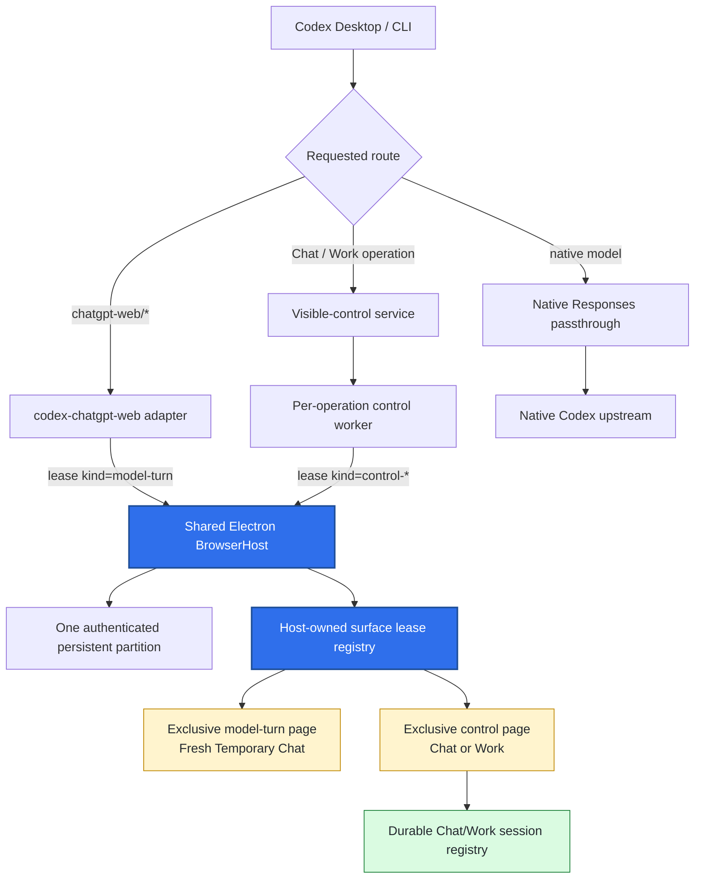
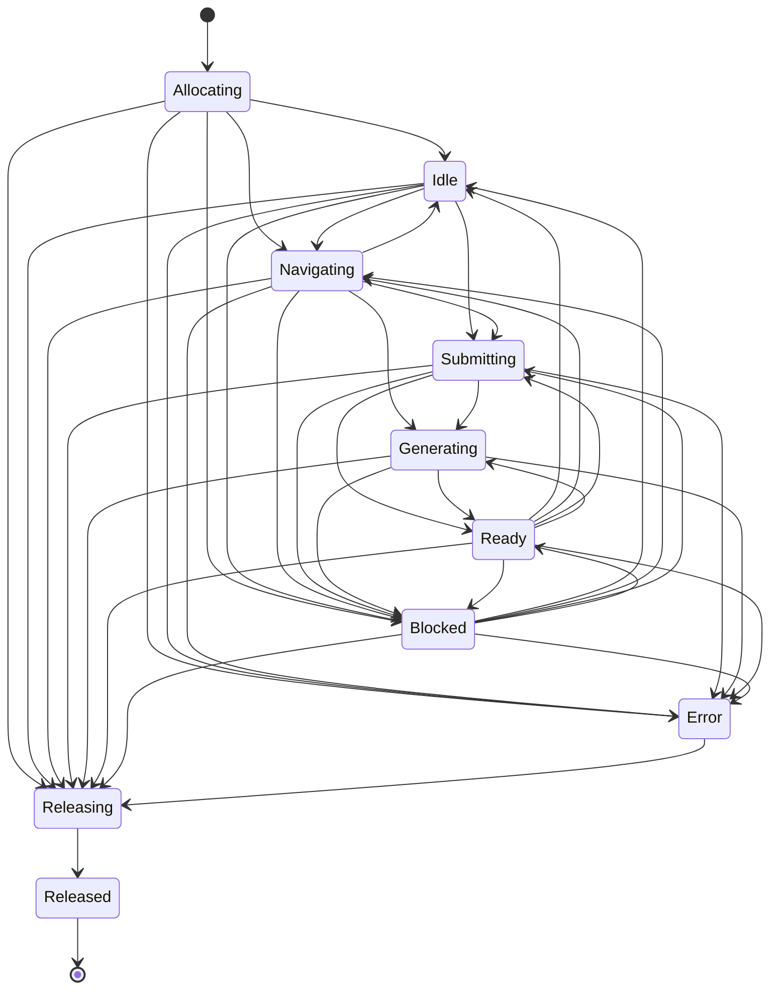
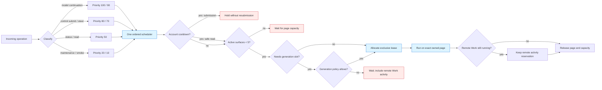
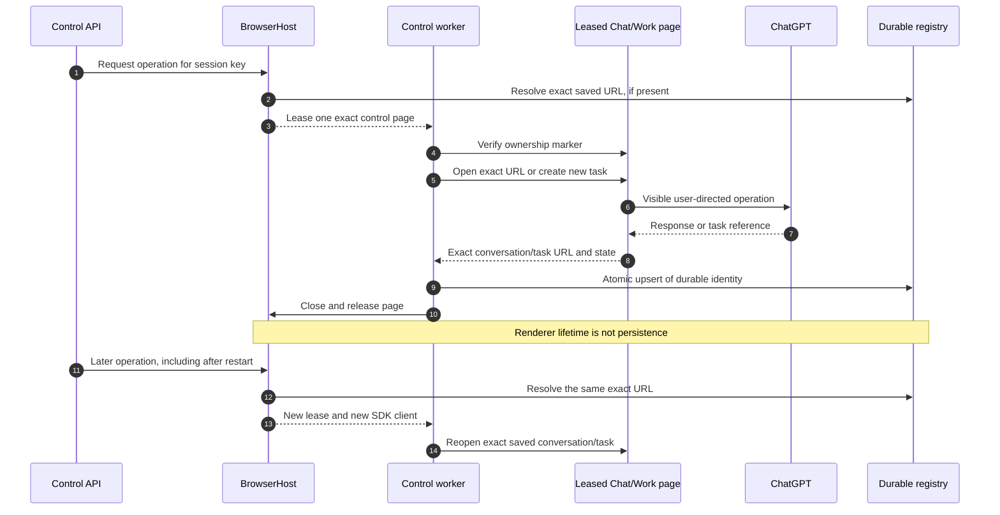

# Architecture diagrams

These diagrams are the visual companion to the standalone architecture and
implementation plan. They intentionally describe only
`codex-chatgpt-web-control`; integration with `agent-system` remains deferred.

The canonical safety invariant is:

> Share the browser process and authenticated partition, never the working
> page. Every active operation owns one exclusive host-issued lease.

## 1. Runtime architecture



## 2. Surface lease lifecycle

The exact transition table in
`packages/browser-leases/src/transitions.ts` is authoritative. This diagram
shows the principal execution and terminal paths.



## 3. Concurrent model and control work without page interference

```mermaid
sequenceDiagram
    autonumber
    participant C as Codex
    participant H as BrowserHost
    participant W as Web model worker
    participant V as Control worker
    participant T as Temporary Chat page
    participant P as Chat/Work page
    participant R as Session registry

    C->>H: Allocate model-turn lease A
    H-->>W: surface A + ownership marker
    C->>H: Allocate control-work lease B
    H-->>V: surface B + ownership marker

    par Web-model turn
        W->>T: Verify marker A
        W->>T: Navigate, configure, submit
        T-->>W: Reasoning, tools, Markdown
    and Visible Work task
        V->>P: Verify marker B
        V->>P: Open Work and submit once
        P-->>V: Exact task URL and state
        V->>R: Persist task identity
    end

    W->>H: Release lease A
    V->>H: Release lease B
    Note over T,P: Same browser process and login; never the same working page
```

## 4. Shared capacity and account scheduler



Initial policy:

```yaml
max_active_surfaces: 5
max_simultaneous_generations: 3
max_control_generations: 2
reserve_model_turn_slots: 1
```

## 5. Durable Chat and Work identity



## 6. Delivery dependency graph

```mermaid
flowchart LR
    M0["M0 Bootstrap + baselines\nNIC-378"]
    M1["M1 Shared host + leases\nNIC-379"]
    M2["M2 Chat / Work runtime\nNIC-380"]
    M3["M3 Scheduler + local API\nNIC-381"]
    M4["M4 Launcher + release\nNIC-382"]

    R["Repository + upstream ancestry\nNIC-383"]
    DOCS["Overlay docs + locks\nNIC-384"]
    BASE["Independent baselines\nNIC-385"]
    CONTRACTS["Lease contracts\nNIC-386"]
    MANAGER["Lease manager\nNIC-387"]
    COMPAT["beginTurn/endTurn facade\nNIC-388"]
    TESTS["Mixed isolation tests\nNIC-389"]
    ADAPTER["Browser contract adapter\nNIC-390"]
    RUNTIME["Per-operation control runtime\nNIC-391"]
    SESSIONS["Durable session registry\nNIC-392"]
    FLOWS["Chat, Work, files, artifacts\nNIC-393"]
    SCHED["Global scheduler\nNIC-394"]
    RATE["Cooldown + exclusive ops\nNIC-395"]
    API["Authenticated loopback API\nNIC-396"]
    WORKERS["Worker isolation\nNIC-397"]
    UI["Unified launcher views\nNIC-398"]
    CLIENTS["Codex + Node/Python interfaces\nNIC-399"]
    FALLBACK["Isolated-control fallback\nNIC-400"]
    RELEASE["Cross-platform RC\nNIC-401"]

    M0 --> M1 --> M2 --> M3 --> M4
    R --> M0
    DOCS --> M0
    BASE --> M0
    CONTRACTS --> MANAGER --> COMPAT --> TESTS --> M1
    M1 --> ADAPTER --> RUNTIME --> SESSIONS --> FLOWS --> M2
    M2 --> SCHED --> RATE --> API --> WORKERS --> M3
    M3 --> UI --> CLIENTS --> FALLBACK --> RELEASE --> M4

    classDef done fill:#dafbe1,stroke:#1a7f37,color:#24292f;
    classDef active fill:#ddf4ff,stroke:#0969da,color:#24292f;
    classDef planned fill:#f6f8fa,stroke:#8c959f,color:#24292f;
    class DOCS,CONTRACTS,MANAGER done;
    class R,M0,M1 active;
    class BASE,COMPAT,TESTS,ADAPTER,RUNTIME,SESSIONS,FLOWS,SCHED,RATE,API,WORKERS,UI,CLIENTS,FALLBACK,RELEASE,M2,M3,M4 planned;
```



## Diagram maintenance

- Update diagrams in the same change that modifies an architectural invariant.
- Keep issue identifiers aligned with Linear.
- Treat code contracts and tests as authoritative when a diagram becomes stale.
- Mirror these diagrams into the canonical Notion architecture page.
